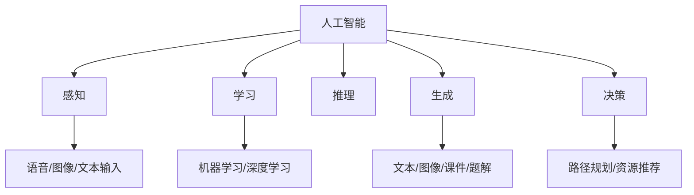

# 第 1 章 人工智能概述

## 学习目标

- 说明人工智能的基本含义和能力边界。
- 区分弱人工智能、强人工智能、生成式 AI 和智能体。
- 能够用“感知-决策-行动-反馈”框架描述一个 AI 系统。

## 核心知识

人工智能关注的是让机器在特定任务中表现出类似人类的感知、理解、推理、学习和决策能力。现代 AI 系统通常由数据、算法、算力和应用场景共同构成。只讨论模型名称而不讨论任务目标、输入输出和评价指标，很容易造成理解偏差。

智能体是理解 AI 应用的一个重要框架。一个学习智能体需要感知学生的问题、学习历史和学习行为，判断当前学习状态，再生成资源、路径或反馈，最后根据学生后续表现更新画像。

## 知识结构

## 常见误区

1. 把人工智能简单等同于深度学习。深度学习是 AI 的重要方法，但 AI 还包括搜索、知识表示、规划、推理和人机交互。
2. 把生成内容当成标准答案。生成式 AI 输出需要经过来源核验、课程标准对照和人工审核。
3. 只关注工具体验，不分析任务。一个 AI 系统必须明确输入、输出、评价指标和使用边界。

## 自测题

1. 用自己的话解释“智能体”和“普通问答系统”的区别。
2. 一个 AI 学习系统至少需要收集哪些学生数据？哪些数据不应该随意收集？
3. 为什么说“模型能力强”不等于“教学效果一定好”？

## 实践任务

选择一个校园学习场景，例如错题诊断、课程资料推荐或学习计划生成，画出系统的输入、处理过程、输出和反馈方式。
