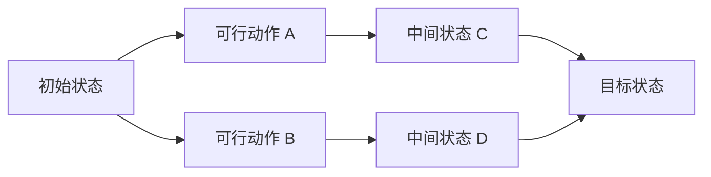

# 第 2 章 搜索与问题求解

## 学习目标

- 能够把现实问题抽象为状态空间。
- 理解广度优先搜索、深度优先搜索、启发式搜索和 A* 算法的区别。
- 能够解释启发函数如何影响搜索效率和结果质量。

## 核心知识

搜索问题通常包含初始状态、目标状态、动作集合、状态转移和路径代价。盲目搜索不使用领域知识，适合小规模问题；启发式搜索利用估价函数引导搜索方向，适合更复杂的任务。A* 算法常用评价函数：

`f(n) = g(n) + h(n)`

其中 `g(n)` 表示从起点到当前节点的实际代价，`h(n)` 表示从当前节点到目标的估计代价。

## 状态空间示意

## 易错点

- 状态没有包含解决问题所需的全部信息。
- 启发函数估计过大，导致 A* 不再保证最优。
- 只背搜索算法名称，不会说明适用条件和代价。

## 例题题解

题目：为校园中“从宿舍到图书馆”的路线规划设计一个搜索问题。

1. 状态：当前位置，可以扩展为“位置+时间段+拥挤程度”。
2. 初始状态：宿舍。
3. 目标状态：图书馆入口。
4. 动作：沿路段移动到相邻地点。
5. 代价：时间、距离或拥挤惩罚。
6. 启发函数：当前位置到图书馆的直线距离。

## 实践任务

把你的日常学习计划看作一个路径规划问题，定义“当前状态”“目标状态”“动作”和“代价”，说明系统如何给出下一步学习建议。
