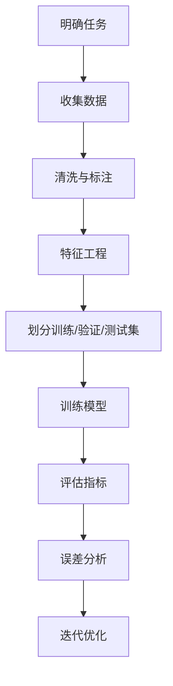

# 第 3 章 机器学习基础

## 学习目标

- 区分监督学习、无监督学习和强化学习。
- 理解训练集、验证集、测试集的作用。
- 能够解释特征工程、过拟合和泛化能力。

## 机器学习流程



## 核心概念

机器学习不是让程序员直接写出所有规则，而是让模型从数据中学习模式。监督学习使用带标签数据学习输入到输出的映射；无监督学习用于发现数据结构；强化学习通过奖励信号学习策略。

数据划分是机器学习实验可信度的基础。训练集用于学习参数，验证集用于调参和模型选择，测试集用于最终评估。如果测试集信息提前参与训练，就会产生数据泄漏。

## 常见误区

1. 只看训练集效果，忽略泛化能力。
2. 特征含义不清，导致模型结果无法解释。
3. 数据清洗没有记录，实验无法复现。

## 代码注释案例

```python
# 伪代码：机器学习实验的基本流程
data = load_dataset("student_learning.csv")      # 读取学生学习行为数据
cleaned = clean_missing_values(data)             # 处理缺失值和异常值
features, labels = build_features(cleaned)       # 构造特征和标签
train, valid, test = split_dataset(features, labels)
model = train_model(train)                       # 只在训练集上学习参数
tune_model(model, valid)                         # 在验证集上选择超参数
report = evaluate_model(model, test)             # 测试集只用于最终评估
```

## 自测题

- 为什么测试集不能参与调参？
- 什么是过拟合？如何缓解？
- 如果模型在训练集准确率很高，但测试集准确率很低，应该优先检查什么？
