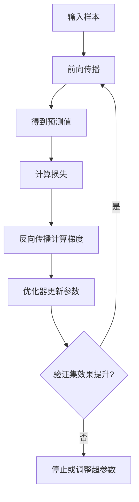

# 第 5 章 神经网络与深度学习

## 学习目标

- 理解人工神经元、层、激活函数和损失函数。
- 能够描述前向传播、反向传播和梯度下降。
- 知道学习率、数据规模和正则化对训练效果的影响。
- 了解 RNN 与 LSTM 在序列建模中的作用和局限。

## 文字讲解

神经网络由多层可学习参数组成。输入数据经过前向传播得到预测结果，预测结果与真实标签比较得到损失，反向传播根据损失计算梯度，优化器再更新参数。这个过程会重复进行，直到模型在验证集上的表现满足要求或不再提升。

循环神经网络（RNN）用于处理序列数据，会把前一时刻的隐藏状态传递给后一时刻。普通 RNN 在长序列中容易出现梯度消失，导致较早的信息难以影响后续预测。LSTM（长短期记忆网络）在 RNN 的基础上加入细胞状态和门控机制，通过遗忘门、输入门和输出门控制信息保留、写入和输出，适合文本、语音、时间序列等需要记忆上下文的任务。

LSTM 不等于所有序列模型。它适合中等长度序列和需要显式门控解释的场景；当任务需要更长上下文或并行训练时，Transformer 和注意力机制往往更常见。

## 训练流程图



## 代码注释案例

```python
# 伪代码：一个训练循环的核心结构
for epoch in range(max_epoch):
    predictions = model.forward(x_train)      # 前向传播，得到预测
    loss = loss_fn(predictions, y_train)      # 计算预测和真实标签的差距
    gradients = loss.backward()               # 反向传播，计算每个参数的梯度
    optimizer.step(gradients)                 # 根据梯度更新模型参数
    valid_score = evaluate(model, x_valid)    # 用验证集观察泛化效果
```

## 分步题解

题目：为什么学习率过大可能导致模型训练不稳定？

1. 学习率决定每次参数更新的步长。
2. 如果步长过大，参数可能越过损失函数的低谷。
3. 损失值可能反复震荡，甚至越来越大。
4. 解决方式包括降低学习率、使用学习率调度或换用更稳定的优化器。

题目：LSTM 为什么能缓解普通 RNN 的长期依赖问题？

1. 普通 RNN 反复使用同一类递归更新，长序列反向传播时梯度容易衰减或放大。
2. LSTM 额外维护细胞状态，为长期信息提供更稳定的传递通道。
3. 遗忘门决定旧信息保留多少，输入门决定新信息写入多少，输出门决定当前状态如何影响隐藏表示。
4. 因此 LSTM 不是简单“记忆更强”，而是用门控结构让模型学习何时保留、何时更新、何时输出信息。

## PPT 页结构

1. 神经网络要解决什么问题。
2. 人工神经元和多层网络示意。
3. 前向传播和损失函数。
4. 反向传播和梯度下降。
5. 常见训练问题：过拟合、欠拟合、学习率不合适。
6. RNN 与 LSTM：序列建模、长期依赖和门控机制。
7. 课堂互动：判断一张训练曲线或序列预测结果出现了什么问题。

## 常见误区

- 网络越深不一定越好。
- 训练集表现好不代表模型真正可用。
- 不记录随机种子、超参数和数据版本会导致实验难以复现。
- 只背 LSTM 三个门的名称，不理解它们分别控制信息遗忘、写入和输出。
