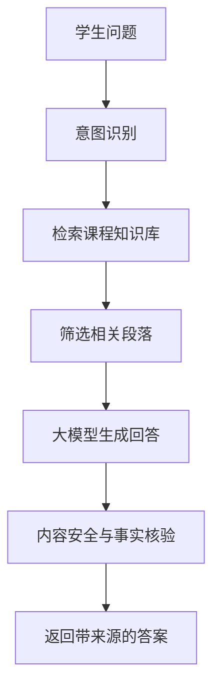

# 第 6 章 自然语言处理与大语言模型

## 学习目标

- 理解自然语言处理的基本任务。
- 了解 Transformer 和大语言模型的核心思想。
- 能够说明提示词、上下文、检索增强生成和防幻觉之间的关系。

## 核心知识

自然语言处理关注机器对文本的理解、生成、分类、检索和对话。大语言模型通过大规模语料训练获得语言建模能力，但它并不天然拥有事实数据库，也不能保证每个输出都正确。

Transformer 的核心是自注意力机制。它不按时间步递归处理序列，而是直接计算序列中各位置之间的相关性；多头注意力可以从不同表示子空间观察词语关系。相比 RNN/LSTM，Transformer 更适合并行训练，也更容易扩展到大规模文本建模。BERT、GPT 等大语言模型都以 Transformer 架构为基础。

实际教学系统中，常将大模型与课程知识库结合，使用 RAG 降低幻觉风险。

## RAG 流程

## 提示词设计要点

1. 明确角色：例如“你是人工智能导论课程助教”。
2. 明确任务：例如“请根据课程知识库解释混淆矩阵”。
3. 明确约束：例如“不要编造文献，不确定时说明需要核验”。
4. 明确输出格式：例如“按概念、例题、练习、复盘四部分输出”。

## 拓展阅读方向

- 文本分类和情感分析。
- 语义检索和向量表示。
- Transformer 结构、自注意力机制和多头注意力。
- RAG、Agent 和工具调用。

## 实践任务

为“人工智能导论课程问答”设计一个 RAG 流程，写出检索字段、生成提示词和内容审核规则。
