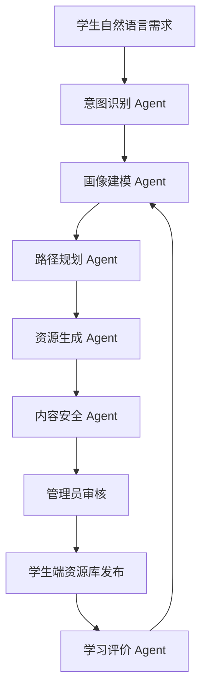

# 第 7 章 多模态资源生成与智能体协同

## 学习目标

- 理解多模态学习资源不只包括视频，也包括文本、图表、流程图、代码注释、题解、PPT 和交互任务。
- 能够说明多智能体在资源生成中的分工。
- 能够设计资源生成后的审核和发布流程。

## 多智能体协作流程

## 资源形态

| 形态 | 作用 | 示例 |
| --- | --- | --- |
| 文字讲解 | 建立概念和逻辑 | 监督学习概念说明 |
| Mermaid 流程图 | 表达过程和关系 | RAG 流程、训练流程 |
| 代码注释 | 帮助理解实现思路 | 训练循环伪代码 |
| 分步题解 | 拆解解题过程 | 混淆矩阵指标计算 |
| PPT 页纲 | 用于课堂演示和复习 | 6 页课件结构 |
| 实践任务 | 形成可提交产出 | 学习风险预警设计 |

## 多模态学习包模板

1. 学习目标：说明本资源解决哪个薄弱点。
2. 文字讲解：用课程语言解释关键概念。
3. 流程图：用 Mermaid 或图示呈现关系。
4. 代码注释：给出可理解的伪代码或核心代码。
5. 分步题解：把典型题拆成可检查步骤。
6. PPT 页纲：便于导出课件。
7. 练习任务：让学生完成可评价产出。
8. 审核提示：标注来源、风险和需要人工复核的地方。

## 内容审核要点

- 是否明确知识来源。
- 是否存在绝对化或未经验证的事实表达。
- 是否与课程目标一致。
- 是否包含学生隐私或敏感内容。
- 是否适合当前学生画像和学习阶段。

## 实践任务

围绕“监督学习与模型评估”生成一份多模态学习包，至少包含文字讲解、Mermaid 流程图、题解、PPT 页纲和练习任务。
