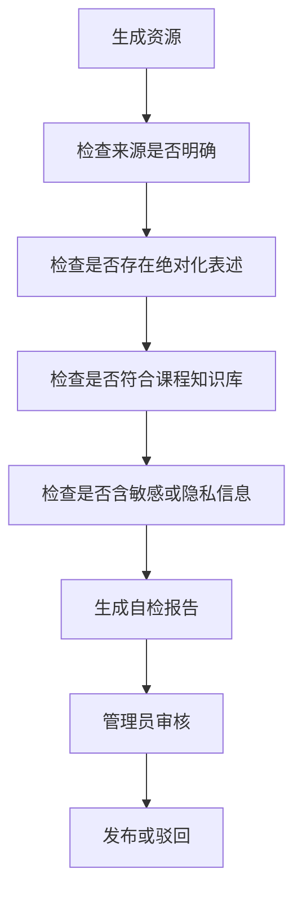

# 第 8 章 AI 安全、伦理与防幻觉

## 学习目标

- 理解 AI 学习系统中的安全、隐私和伦理问题。
- 能够设计生成内容的防幻觉检查流程。
- 能够说明人工审核在教育场景中的必要性。

## 核心知识

教育场景中的 AI 系统既要追求个性化，也要保证内容可靠、边界清晰、隐私安全。生成内容不能直接等同于课程标准答案，尤其是涉及事实、公式、实验结论和学习评价时，需要来源、核验和人工复核。

## 防幻觉流程

## 检查清单

- 资源是否标注课程章节或知识库来源。
- 结论是否可以被课程资料、教材或实验数据支持。
- 是否出现“绝对正确”“唯一答案”等不适合教学的表达。
- 是否暴露学生隐私数据。
- 是否给出超出系统能力范围的承诺。
- 是否保留人工复核入口。

## 常见误区

1. 认为大模型回答流畅就一定正确。
2. 为追求个性化收集过多学生敏感信息。
3. 资源生成后没有审核，直接发布给学生。
4. 缺少日志记录，无法追踪错误资源来源。

## 实践任务

设计一份“AI 生成学习资源审核表”，包含事实性、结构性、安全性、适配性和发布结论五个部分。
