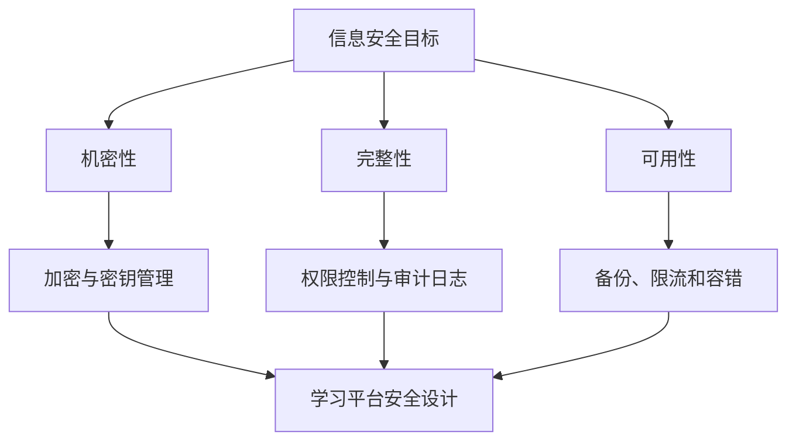

# 第 9 章 信息安全基础拓展

## 学习目标

- 理解信息安全的三类基本目标：机密性、完整性和可用性。
- 能够区分密码学、身份认证、访问控制、网络安全和系统安全的学习重点。
- 能够把信息安全要求映射到学习平台的数据、账号、资源审核和日志场景。

## 核心知识

信息安全关注的是在真实系统中保护数据、身份、服务和业务流程。学习时可以先从 CIA 三元组入手：

- 机密性：未授权的人不能看到敏感数据，例如学生画像、成绩、错题记录和 API Key。
- 完整性：数据不能被未授权篡改，例如资源审核结果、学习报告和用户权限。
- 可用性：系统在合理压力和故障下仍能提供服务，例如登录、对话、资源访问和数据库连接。

在高校学习平台中，信息安全不是单独的“攻防技巧”，而是贯穿账号体系、接口鉴权、数据库权限、资源审核、日志追踪和隐私保护的工程能力。

## 知识结构

## 与 AI 学习系统的关系

1. 用户账号：登录账号应唯一，密码应加密存储，权限应区分学生和管理员。
2. 学习数据：画像、评价、错题和对话记录属于敏感学习数据，展示和导出都需要边界。
3. 资源生成：AI 生成内容进入资源库前应经过审核，避免错误、违规或不适合课程的内容直接发布。
4. API Key：大模型密钥只能放在后端环境变量中，不能写入前端代码或提交到仓库。
5. 日志追踪：系统应保留必要 trace，便于定位生成错误，但学生端不展示内部推理链路。

## 常见误区

- 把信息安全只理解为攻击技术，忽略账号、权限、审计和隐私保护。
- 认为本地演示系统不需要安全设计，导致演示数据和 API Key 暴露。
- 把 AI 安全、防幻觉和传统信息安全完全割裂。
- 只做前端隐藏按钮，不在后端做权限和数据边界校验。

## 实践任务

为 LingXi 学习平台设计一份信息安全检查清单：

1. 列出学生端、管理员端和后端接口中的敏感数据。
2. 标注每类数据的访问角色和修改权限。
3. 检查 API Key、数据库连接、登录密码和审核日志是否有泄露风险。
4. 给出至少 5 条改进建议，并说明它们分别对应机密性、完整性或可用性。
