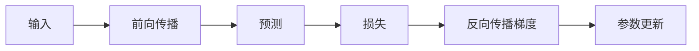

# 第 4 章 前向传播、损失函数与反向传播

## 学习目标
- 区分前向传播、损失计算和反向传播。
- 用链式法则解释梯度如何逐层传递。
- 能读懂 PyTorch autograd 的基本现象。

## 核心内容
前向传播负责从输入得到预测，损失函数衡量预测与真实标签差距。反向传播基于链式法则计算每个参数对损失的影响，优化器再据此更新参数。

## 常见误区
- 反向传播不是把模型倒着跑一遍，而是在计算图上按链式法则传递梯度。
- loss、gradient、update 是三个不同环节。
- 梯度消失和梯度爆炸会影响深层网络和序列模型训练。
