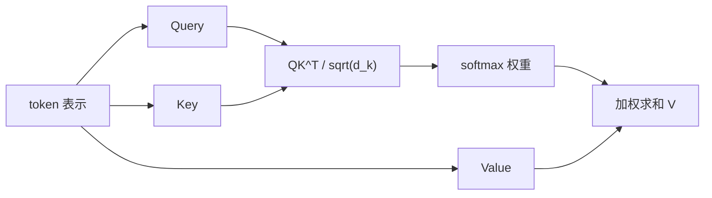

# 第 9 章 Attention 与 Transformer

## 学习目标
- 理解 Query、Key、Value 的作用。
- 能说明自注意力权重如何计算。
- 理解多头注意力和位置编码的必要性。

## 核心公式
`Attention(Q, K, V) = softmax(QK^T / sqrt(d_k))V`

## 直观解释
自注意力让每个 token 根据与其他 token 的相关性聚合信息。多头注意力从多个子空间并行学习关系，位置编码弥补注意力本身不含顺序信息的问题。

## 常见误区
- 注意力权重有解释价值，但不能简单等同于因果解释。
- 忽略缩放因子会影响 softmax 分布稳定性。
- 没有位置编码时，模型难以区分顺序。
