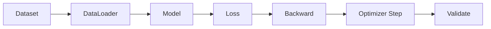

# 第 11 章 PyTorch 深度学习工程实践

## 学习目标
- 能组织 Dataset、DataLoader、模型、损失函数和优化器。
- 能写出训练循环和验证循环。
- 能记录实验参数、loss 曲线和评价指标。

## 训练流程


## 最小代码骨架
```python
for x, y in train_loader:
    pred = model(x)
    loss = criterion(pred, y)
    optimizer.zero_grad()
    loss.backward()
    optimizer.step()
```

## 常见误区
- 不检查 tensor shape。
- 训练集、验证集混用。
- 不固定随机种子和不记录超参数。
